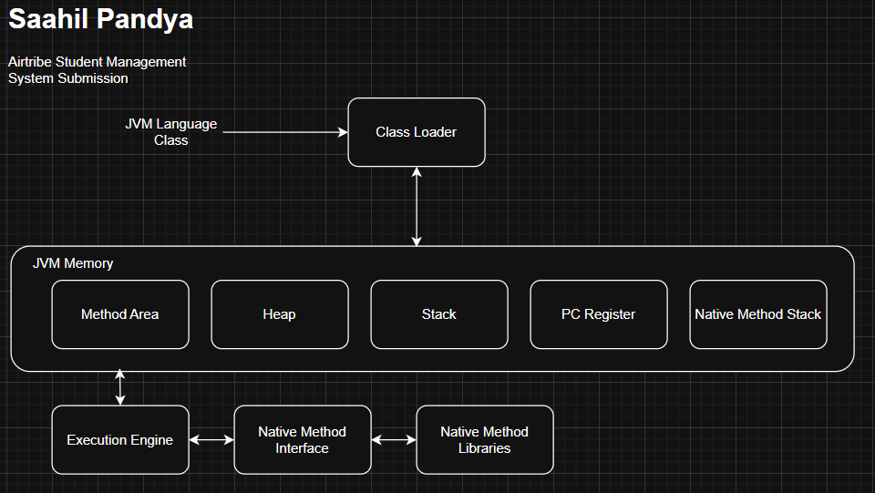

# JVM Architecture & Internal Components Report

## 1. Overview
The Java Virtual Machine (JVM) is the engine that drives Java code. It is an abstract machine that provides a runtime environment in which Java bytecode can be executed.

## 2. Key Subsystems

### A. Class Loader Subsystem
This is the first component to act. When we run a program, it is responsible for:
1.  **Loading:** Reads the `.class` file and generates binary data.
2.  **Linking:**
    * *Verification:* Ensures the bytecode is safe and follows Java rules (e.g., no unauthorized memory access).
    * *Preparation:* Allocates memory for static variables.
    * *Resolution:* Replaces symbolic references with direct memory references.
3.  **Initialization:** Assigns static variables their defined values and executes static blocks.

### B. Runtime Data Areas (Memory)
This is how the JVM organizes memory:
1.  **Method Area:** Stores class-level data (code, static variables, constant pool). Shared among all threads.
2.  **Heap Area:** The runtime data area where **Objects** are allocated. This is the main area managed by Garbage Collection. Shared among all threads.
3.  **Stack Area:** Stores frames for method calls. Each frame holds local variables and partial results. Thread-safe (each thread has its own stack).
4.  **PC Register:** Holds the address of the current instruction being executed.
5.  **Native Method Stack:** Used for native methods (written in C/C++).

### C. Execution Engine
The component that actually executes the bytecode.
1.  **Interpreter:** Reads bytecode stream then executes the instructions.
2.  **JIT Compiler:** (Detailed in Section 3).
3.  **Garbage Collector:** Automatically reclaims memory by destroying objects that are no longer referenced.

---

## 3. JIT Compiler vs. Interpreter

Java uses a hybrid execution model to balance startup time and long-term performance.

| Feature | Interpreter | JIT (Just-In-Time) Compiler |
| :--- | :--- | :--- |
| **Operation** | Translates bytecode to machine code line-by-line. | Compiles entire blocks of "hot" bytecode into native machine code. |
| **Startup Speed** | Fast. It starts executing immediately. | Slower. It requires time to analyze and compile code. |
| **Execution Speed** | Slower for repeated code (re-translates loops every time). | Very Fast. It executes the cached native code directly. |
| **Role in JVM** | Handles the initial execution of the application. | Kicks in later for frequently called methods ("Hotspots"). |

**Synthesis:** The JVM starts with the Interpreter to get the app running quickly. Background profilers monitor the code; when a method is called frequently, the JIT compiles it to native code for maximum performance.

---

## 4. The Bytecode Execution Process
1.  **Source:** Developer writes `Main.java`.
2.  **Compile:** `javac` converts it to `Main.class` (Bytecode). This code is not understandable by the CPU yet.
3.  **Load:** The JVM Class Loader brings `Main.class` into RAM.
4.  **Verify:** The Bytecode Verifier ensures the code is not malicious.
5.  **Execute:** The Execution Engine translates the Bytecode instructions into specific Machine Code (0s and 1s) that the underlying processor (Intel, ARM, etc.) understands.

---

## 5. "Write Once, Run Anywhere" (WORA)

This principle allows Java applications to be developed on one OS (e.g., Windows) and run on another (e.g., Linux) without recompilation.

**How it works:**
* Java Source code is compiled into **Bytecode**, which is platform-neutral.
* The **JVM** acts as a bridge/adapter.
* There is a specific JVM implementation for every OS (Windows JVM, Linux JVM, macOS JVM).
* All these JVMs understand the *same* Bytecode but translate it into *different* native machine instructions required by their specific OS.

Therefore, the developer only worries about the Bytecode, while the JVM handles the OS specifics.