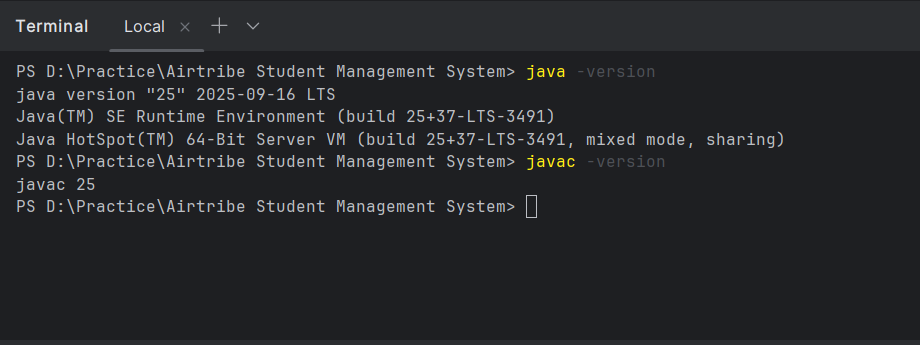

# Development Environment Setup Guide

## 1. JDK Installation
**Selected Version:** Java 25 (LTS)
**Rationale:** Chosen for utilizing the latest language features and long-term support stability.

### Installation Verification:
1.  **Version Check:** Validated current installation using command line tools.
2.  **Output:** * `java -version` -> `Java version "25" 2025-09-16 LTS`
    * `javac -version` -> `javac 25`

## 2. Environment Variables Configuration
To ensure the Java compiler and runtime are accessible from any directory (as shown in the terminal verification), the system Environment Variables were configured.

### Configuration for Windows:
1.  **JAVA_HOME:** Set to the JDK 25 installation directory (e.g., `C:\Program Files\Java\jdk-25`).
2.  **Path Variable:** Appended `%JAVA_HOME%\bin` to the system Path.
    * *Note:* The user provided path `C:\Program Files\JetBrains\IntelliJ IDEA 2025.2.3\bin` relates to the IDE, but the global system `java` command is resolving to the Oracle JDK 25 installation as proven by the `Java(TM)` output in the screenshot.

## 3. Verification Screenshot
Below is the terminal proof showing the successful configuration of the Java 25 environment in a PowerShell session.

*(Note: Screenshot confirms working `java` and `javac` commands on Windows)*